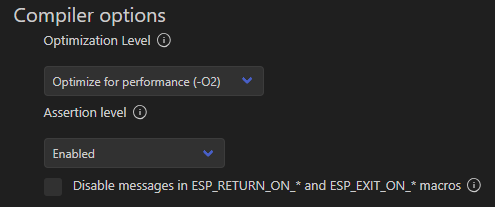

# ESP-IDF component for VL53L0X ToF distance sensor
Based on VL53L0X_1.0.4 API version.

## Notes
In order to compile the program correctly, change following option in `menuconfig`:



## Sources
* https://github.com/kerikun11/ESP32_VL53L0X
* https://www.st.com/resource/en/datasheet/vl53l0x.pdf
* https://www.st.com/en/embedded-software/stsw-img005.html#overview

## Example
```C
#include <stdio.h>
#include "freertos/FreeRTOS.h"
#include "freertos/task.h"
#include "esp_log.h"
#include "vl53l0x.h"

#define I2C_PORT    I2C_NUM_1
#define SDA_PIN     GPIO_NUM_27
#define SCL_PIN     GPIO_NUM_19
#define GPIO1_PIN   GPIO_NUM_26
#define XSHUT_PIN   -1
#define I2C_FREQ    400000

static const char *TAG = "main";


void app_main(void)
{
    vl53l0x_conf_t vl53l0x_conf = {
        .i2c_port = I2C_PORT,
        .sda_pin = SDA_PIN,
        .scl_pin = SCL_PIN,
        .i2c_freq = I2C_FREQ,
        .xshut_pin = XSHUT_PIN,
        .gpio1_pin = GPIO1_PIN
    };
    vl53l0x_init(vl53l0x_conf);

    // measurement
    while (1)
    {
        uint16_t result_mm = 0;
        TickType_t tick_start = xTaskGetTickCount();
        bool res = vl53l0x_read(vl53l0x_conf, &result_mm);
        TickType_t tick_end = xTaskGetTickCount();
        int32_t took_ms = (int32_t)(tick_end - tick_start) / portTICK_PERIOD_MS;
        if (res)
            ESP_LOGI(TAG, "Range: %hu [mm] took %ld [ms]", result_mm, took_ms);
        else
            ESP_LOGE(TAG, "Measure failure");
    }
}
```
